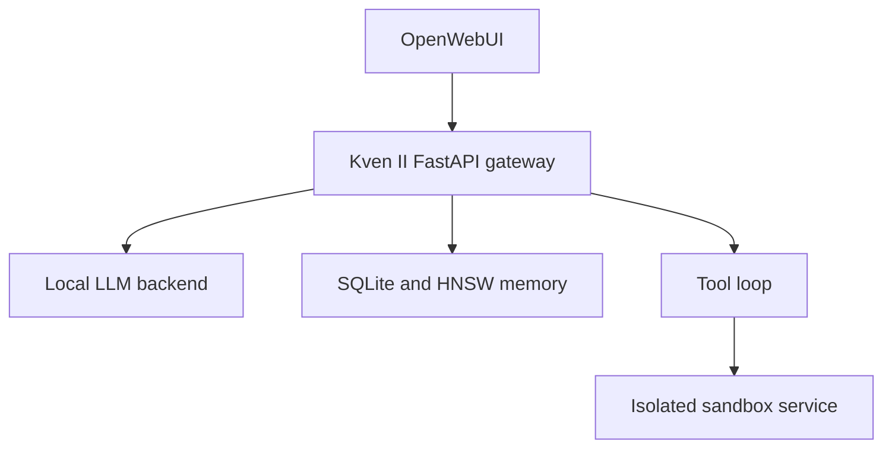

# Kven II

Kven II is an experimental local LLM agent with long-term memory, retrieval, and tool-calling capabilities.

The project explores how a locally hosted language model can act as a persistent systems and research assistant while remaining under the owner's control.

## Current status

Kven II is an active research prototype running in an isolated private lab.

It is not production-ready. Interfaces, configuration, memory schemas, and tool behavior may change without backward compatibility.

## Architecture

The current lab implementation uses OpenWebUI, FastAPI, llama.cpp-compatible backends, SQLite, HNSW, and SentenceTransformers.

Implemented capabilities
OpenWebUI-compatible model gateway
Local large-model and optional small-model backends
Episodic and semantic long-term memory
Vector retrieval with HNSW
RAG context injection
Native and gateway-managed tool calling
Tool-loop protection and repetition detection
Separate command-execution sandbox
Session and project context
Current date and time injection
Repository contents

This repository contains source code and configuration examples.

It intentionally excludes:

credentials and local .env files
memory databases and vector indexes
model weights
virtual environments
logs, checkpoints, and runtime data
Security warning

Kven II can execute tools and operating-system commands.

Run it only in an isolated environment with appropriate backups and access controls. Do not expose the sandbox service directly to untrusted networks.

Roadmap
Move remaining lab-specific endpoints into environment configuration
Add automated tests and continuous integration
Document installation and deployment
Containerize individual AI services
Compare llama.cpp, vLLM, and SGLang backends
Add reproducible performance profiling
Improve multi-model orchestration
Prepare a sanitized reference deployment
Author

Eugene Kuris
