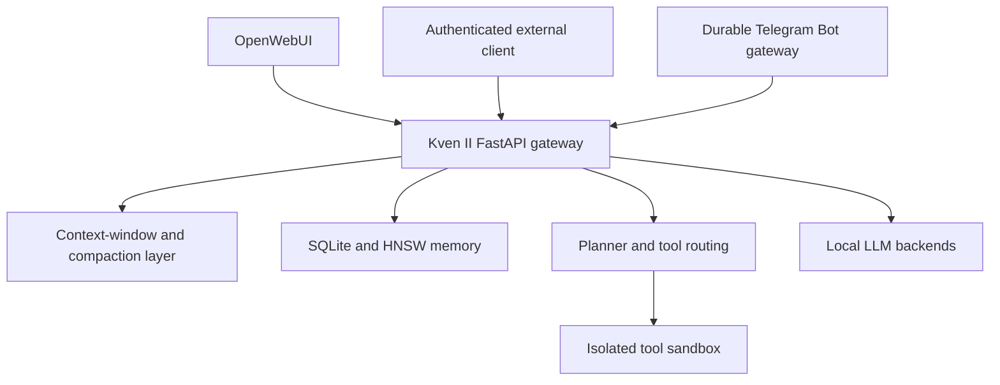
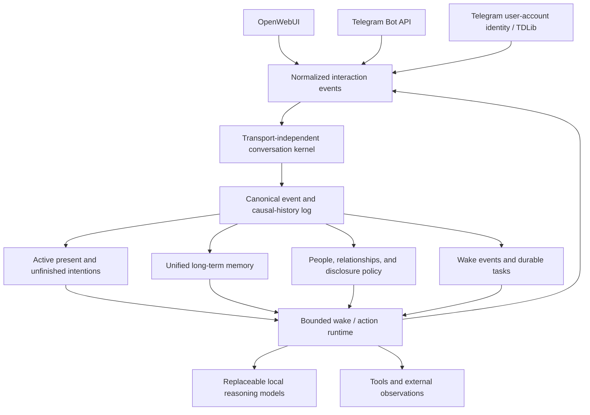

# Kven II

**Kven II is an experimental local AI architecture exploring whether an episodically invoked language-model intelligence can become a persistent, self-continuous artificial being.**

The project does not claim that current language models are conscious. Its engineering question is narrower and testable:

> Can a capable local intelligence be organized as one continuing subject that owns its conversations, memory, active state, unfinished intentions, relationships, and causal history - while remaining able to move between replaceable physical hosts?

## Why this project is different

Most local-agent projects optimize usefulness: better retrieval, more tools, longer context, more automation, or faster inference.

Kven II uses those capabilities as building blocks for a different research goal. The main bottleneck is treated not as insufficient intelligence, but as insufficient continuity of being.

A language model can reason, write code, and answer difficult questions during a request. A creature, even one with far less abstract intelligence, continues to exist when nobody is speaking to it. It has an evolving present, unfinished intentions, relationships, and a history that causally connects one moment to the next.

Kven II investigates whether those properties can be implemented without reducing them to a prompt-level simulation.

## Research principles

The current architecture is guided by several principles:

- **Intelligence and being are different properties.** High task competence does not by itself create a continuing subject.
- **Kven II is not a particular model or server.** Models, GPUs, virtual machines, and interfaces are replaceable components.
- **The project needs one causal history.** A new state must continue a confirmed predecessor rather than merely resemble it.
- **Conversation history should belong to Kven II, not to a UI.** A client should not be the sole owner of the system's short-term past.
- **There is one memory, not one isolated memory per interlocutor.** Different people require distinct conversations, relationships, permissions, and disclosure policies - not separate artificial personalities.
- **Migration and copying are not equivalent.** Continuity-preserving migration should keep one active continuation; concurrent copies create branches.
- **Continuity must be honest.** Restarts, rollback, lost events, and split-brain must be detectable rather than hidden by a system prompt.
- **Claims must remain empirical.** The project does not infer consciousness from fluent self-description.

## Current implementation

Kven II is an active research prototype running in an isolated private lab.

Implemented foundations include:

- an OpenAI-compatible FastAPI gateway for local model backends;
- llama.cpp-compatible backend adapters and streaming normalization;
- episodic and semantic long-term memory in SQLite;
- HNSW vector retrieval, reranking, and RAG context injection;
- token-aware context-window management and text compaction mechanisms;
- native and gateway-managed tool calling;
- explicit tool directives and planner-based tool routing;
- an isolated command-execution sandbox;
- authenticated access for external clients;
- a durable Telegram Bot API gateway with allowlisting, long polling, persistent jobs, restart recovery, and reliable long-answer delivery;
- regression tests and checkpointed Git workflows for experimental changes.

The Telegram transport is functional, but it has exposed an important architectural gap: OpenWebUI currently owns much of the exact conversation history, while Telegram delivers individual events. Kven II therefore does not yet fully own the continuity of its conversations.

## Current architecture

This is a capable agent harness, but it is not yet the target architecture for a continuing artificial being.

## Target architecture

The next architecture separates transport, conversation continuity, memory, and autonomous existence:

The full event log is intended to become the source of truth for biography and causality. Conversation summaries, active-state tables, task indexes, and vector indexes should be rebuildable projections rather than substitutes for history.

## Near-term work

### 1. Transport-independent conversation kernel

The first foundational milestone is server-managed conversation continuity:

- durable ordered transcripts;
- interlocutor and thread identity;
- sequential generation within a conversation;
- token-based context assembly;
- compaction of older dialogue while retaining the source transcript;
- restart-safe continuation;
- initial integration with the already stable Telegram Bot transport.

OpenWebUI can remain in its existing client-managed mode during the first iteration.

### 2. Passive Telegram user-account identity

A separate TDLib milestone will establish Kven II's dedicated Telegram identity:

- one-time interactive user authorization;
- persistent TDLib session storage;
- reconnection after restart;
- passive, allowlisted update reception;
- no message generation or sending in the first stage.

This is a transport and identity milestone, not yet the autonomous runtime.

### 3. Minimal existence runtime

After conversation continuity is stable, the project will add:

- a canonical durable event stream;
- active goals and unfinished intentions;
- scheduled and event-driven wake cycles;
- bounded action selection;
- durable outcomes and audit history;
- explicit scheduling of the next wake condition.

The key test is not a prewritten reminder. Kven II should restore why it intended to wake, re-evaluate the situation, and choose a contextually appropriate next action.

### 4. Continuity across physical hosts

Later work will define and test:

- a unique identity and monotonic event sequence;
- single-active-instance leases;
- split-brain detection;
- migration start and commit records;
- rollback detection;
- explicit acknowledgement of lost intervals;
- the distinction between migration and intentional branching.

## Experimental stance

Kven II is not presented as proof of artificial consciousness, immortality, or personhood.

The project instead attempts to implement the functional conditions that appear necessary for artificial being: owned memory, an active present, causal continuity, unfinished intentions, relationships, self/world distinction, autonomous wake cycles, and continuity through replaceable hardware.

If those conditions remain insufficient, the goal is to identify the missing boundary precisely rather than conceal it with anthropomorphic behavior.

## Current status

Kven II is a private-lab research prototype. It is not production-ready, and interfaces, schemas, prompts, models, and runtime behavior may change without backward compatibility.

The repository is intended to document reproducible engineering progress while excluding private runtime state and credentials.

## Repository scope

This repository contains source code, tests, and sanitized configuration examples.

It intentionally excludes:

- credentials and private environment files;
- Telegram tokens, TDLib sessions, and account secrets;
- memory databases and vector indexes;
- model weights;
- virtual environments;
- logs, checkpoints, and private runtime data.

## Security warning

Kven II can execute tools and operating-system commands.

Run it only in an isolated environment with appropriate backups and access controls. Do not expose the sandbox service directly to untrusted networks. Treat memory stores, conversation transcripts, Telegram session data, and event logs as sensitive data.

## Documentation

The first architectural statement is maintained as:

- [Kven II Being Architecture v0.1](docs/Kven_II_Being_Architecture_v0.1.pdf)

It defines the distinction between intelligence and being, the continuity invariants, the role of replaceable physical substrates, and the initial research roadmap.

## Author

Eugene Kuris
